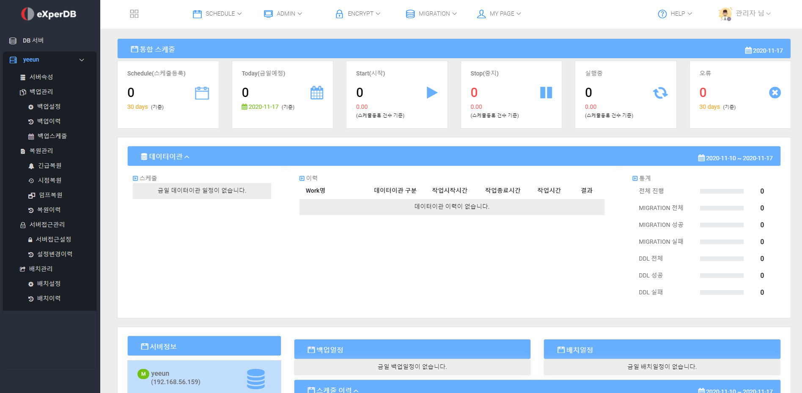

# eXperDB-Management
[](https://travis-ci.org/travis-ci/travis-web)


eXperDB or PostgreSQL Management Tool

## Introduction
eXperDB-Management is a PostgreSQL management tool(for efficient operation and management). Use backup settings and periodic scheduling to prepare for system failures, grant access to the system, and view backup and access control history. It also provides data encryption for information protection.





## Features
* Backup
  - Full backup, Incremental backup, Other backups with the pg_dump options
* Restore
  - Emergency restore, Point-in-Time Restore, pg_dump restore
* Access control
  - Access control settings based on pg_hba.conf and audit 
* Scheduling
  - Schedule for tasks that need to be done on a regular basis
* Data transmission
  - Real-time data transfer from PostgreSQL to HDFS
* Data Encryption
  - Data Encryption for Information Protection
* Multiple Languages Support
  - Korean, English
  
※ Supports PostgreSQL Version 10.7


## TODO
* Supports PostgreSQL Version 11

## License
[](https://github.com/experdb/eXperDB-Management/blob/master/LICENSE)


## Getting Started
### Installation
#### System Requirements
* OS : Developed and tested on Linux and Windows, but work on any UNIX-like system and Windows System
* JDK : JDK 1.7 or later
* CPU : At least 4core, recommended 8core
* HDD : 100GB or more
* WAS : Apache-Tomcat

#### Components
* eXperDB-Management-Agent
* eXperDB-Management-WebConsole
* eXperDB-Management Repository Database

#### 1. Installing eXperDB-Management-Agent

1-1. Install agent using eXperDB-Management-Agent-10.7.1.0.run file 
```
1-2-1. Upload to installation target server using FTP program  
1-2-2. Run eXperDB-Management-Agent-10.7.1.0.run file  
1-2-3. cd eXperDB-Management-Agent/bin    
1-2-4. chmod 755 agent_setup.sh   
1-2-5. ./agent_setup.sh    
1-2-6. Enter information (DBMS IP, Port, Default Database, Username, password, Agent IP, Agent Port)       
```

1-3. Starting and stopping the agent
```    
1-3-1. Start : experDB-Management-Agent/bin/startup.sh   
1-3-2. stop : experDB-Management-Agent/bin/stop.sh
``` 


#### 2. Installing eXperDB-Management-WebConsole

2-1. Install agent using eXperDB-Management-WebConsole-10.7.1.0.run file 
```
2-2-1. Upload to installation target server using FTP program  
2-2-2. Run eXperDB-Management-WebConsole-10.7.1.0.run file  
2-2-3. cd eXperDB-Management-WebConsole/webapps/eXperDB-Management-WebConsole/WEB-INF/classes    
2-2-4. chmod 755 webConsole_setup.sh  
2-2-5. ./webConsole_setup.sh    
2-2-6. Enter information (DBMS IP, Port, Default Database, Username, password)       
```

2-3. Starting and stopping the agent    
```
2-3-1. Start : eXperDB-Management-WebConsole/bin/start.sh   
2-3-2. Stop : eXperDB-Management-WebConsole/bin/shutdown.sh  
```


## Appendix
[1. Installation eXperDB-Trnasfer(for Data Transfer)](https://github.com/experdb/eXperDB-Management/blob/master/eXperDB-Transfer.md)


## Contribution
If you find a bug, please report to us by posting issues on Github.  
Source code modifications via pull requests are welcome.  
Also, if you would like to contact us directly, please send an email to experdb@inzent.com.


## Copyright
Copyright (c) 2016-2019, eXperDB Development Team
All rights reserved..


## Community
* https://www.facebook.com/experdb
* http://cafe.naver.com/psqlmaster
